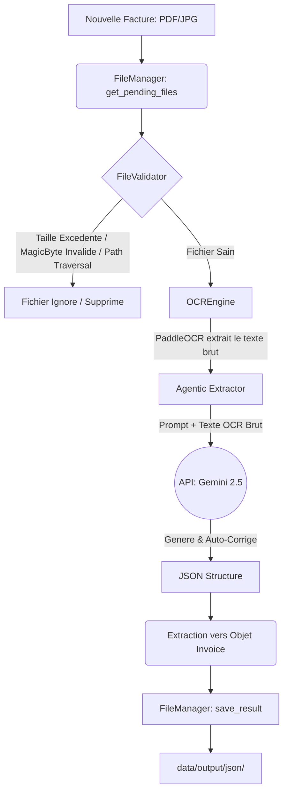

# Agentic Invoice Processor (OCR + Gemini LLM)


Un processeur de factures "Production-Grade" combinant la reconnaissance optique de caractères (PaddleOCR) pour extraire le texte brut, et une extraction sémantique intelligente pilotée par un agent IA (Google Gemini).

Conçu avec des principes d'architecture logicielle solides (AOP, Singleton) et une couche de sécurité robuste (Sanitization, MIME validation), ce système s'adapte a n'importe quel type de facture (Standard, Internationale, Fret, Proforma) et genere des resultats coherents en JSON.

---

## Le But du Projet et Philosophie
Les approches traditionnelles d'extraction via RegEx (Expressions Regulieres) sont fragiles face au changement de format (typoscripts, OCR mal aligné, polices exotiques). L'ajout perpétuel de regles re.compile mène au cauchemar de la maintenance (Spaghetti Code).

Le but de ce projet est de déléguer la compréhension contextuelle et la validation mathématique (ex: HT + TVA = TTC) a une IA sémantique (Zero-Failure Agentic Extraction). Notre code ne s'occupe que de sécuriser l'image, gérer le flux I/O, et appeler l'Agent de la maniere la plus propre possible.

---

## Architecture Adoptée (Design Patterns)

L'application suit une Clean Architecture modulaire :

1. Aspect-Oriented Programming (AOP) :
   Gestion centralisee des erreurs via le décorateur @handle_exceptions (app/core/aspect.py). Ce décorateur enveloppe chaque couche et mappe les erreurs standards vers nos Custom Exceptions. Résultat : Zero try/except dans la logique métier.
   
2. Singleton Thread-Safe : 
   OCREngine est un Singleton avec gestion de lock (threading.Lock()). Garantit que le modele CPU intensif de PaddleOCR n'est chargé en mémoire vive qu'une seule fois, même en cas de multi-threading massif.

3. Stratégie Agentique (Prompt Engineering) : 
   La logique d'extraction (app/core/extractor.py) ne parse plus directement de Regex. Elle assemble un System Prompt avec le texte OCR brut et demande au modele de générer et valider un JSON respectant un schéma dynamique sans valeurs null.

4. Security Validator (OWASP Compliance) :
   app/utils/security.py implémente un bouclier en 3 niveaux :
   - Taille Limitee : Bloque les attaques DDoS (Out-of-Memory).
   - MIME checking par Magic Bytes : Empèche le file masquerading (ex: .exe renommé en .jpg), via la lib filetype.
   - Sanitization des Paths : Bloque les attaques Local File Inclusion (LFI) en utilisant werkzeug.

---

## Flux de Requête (Request Flow)



---

## Installation & Configuration

1. Environnement Virtuel (Strictement Recommande) :
```bash
python3 -m venv venv
source venv/bin/activate
```

2. Installer les Dépendances :
```bash
pip install -r requirements.txt
pip install python-dotenv google-generativeai filetype werkzeug pymupdf
```

3. Variables d'Environnement :
Creez un fichier .env a la racine (ne commitez jamais ce fichier sur Git) :
```env
GEMINI_API_KEY=AIzaSyVotreCleSecreteIci...
```

4. Lancement :
Deplacez vos factures/PDFs dans data/input/.
```bash
python main.py
```

---

## Exemples d'Execution

Entree : Une Facture de dedouanement (Fret Maritime) tres bruyante au format PDF.
Sortie Typique (JSON) generee et validee mathematiquement :
```json
{
  "invoice_number": "FR-98020-X",
  "date": "2023-11-05",
  "supplier_name": "TRANSIT MARITIME SARL",
  "supplier_tax_id": "ICE: 00028288",
  "destinataire": "SOCIETE ALPHA IND.",
  "port": "CASA PORT",
  "moyen_transport": "MSC VESSEL 40FT",
  "incoterm": "CIF",
  "amounts": {
    "total_excl_tax": 45000.0,
    "tax_amount": 9000.0,
    "total_incl_tax": 54000.0
  },
  "currency": "MAD",
  "items": [
    {
      "description": "Frais de dedouanement",
      "quantity": 1.0,
      "unit_price": 45000.0,
      "total_price": 45000.0
    }
  ],
  "confidence_score": 0.98
}
```

---

## Conseils pour les Modifications (Developer Guidelines)

- Ajouter un champ d'extraction (ex: IBAN, Email du fournisseur)
  1. Editez la constante _SYSTEM_PROMPT dans app/core/extractor.py pour demander a l'IA d'extraire ce champ dans le schema JSON cible.
  2. Ajoutez le champ avec des valeurs optionnelles (Optional[str] = None) dans votre dataclass Invoice (app/models/invoice.py).
  3. Mettez a jour le mapping _map_to_invoice dans l'extracteur avec data.get("votre_champ").

- Reglages de la Securite
  Si vos factures PDF pèsent souvent lourd, modifiez MAX_FILE_SIZE_MB dans app/utils/security.py. Evitez de depasser les 20MB pour garantir que l'appel OCR ne remplisse pas toute la memoire RAM.

- Migration ou changement de modele LLM
  Si vous souhaitez changer Gemini pour un modele local (ex: Ollama, Llama3) ou OpenAI (GPT-4) pour des raisons de conformite RGPD, vous n'avez pas besoin de changer l'architecture. Implementez simplement le nouvel appel API au coeur de la classe Extractor et assurez-vous de parser le JSON recu.

- Tests (PyTest)
  Le projet s'appuie sur pytest-mock pour mocker le reseau (les APIs et chargeurs lourds CPU) : 
  ```bash
  PYTHONPATH=. pytest tests/test_ocr.py -v
  ```
  Ne modifiez pas la logique metier sans relancer cette commande !